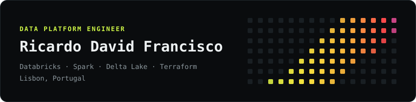
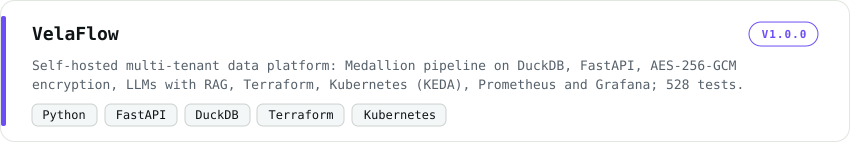
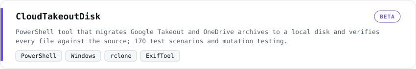
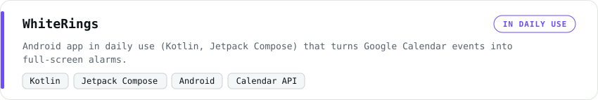
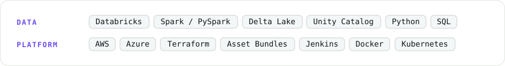

I build and run data platforms on Databricks: PySpark and Delta Lake pipelines, infrastructure as code with Terraform and Asset Bundles, Unity Catalog governance and cost visibility. I work at bolttech in Lisbon. Before data, I spent nine years as a project manager in architecture and real estate.

### Now

- Running a governed lakehouse on Databricks (AWS) at bolttech.
- CloudTakeoutDisk: public beta, with the known issues listed in the repo.
- WhiteRings: preparing the Google Play and F-Droid releases.

### Projects

<a href="https://github.com/ricardo-david-francisco/VelaFlow-public">
<picture>
  <source media="(prefers-color-scheme: dark)" srcset="assets/project-velaflow-dark.svg">
  
</picture>
</a>

<a href="https://github.com/ricardo-david-francisco/CloudTakeoutDisk-public">
<picture>
  <source media="(prefers-color-scheme: dark)" srcset="assets/project-cloudtakeoutdisk-dark.svg">
  
</picture>
</a>

<a href="https://github.com/ricardo-david-francisco/WhiteRings-public">
<picture>
  <source media="(prefers-color-scheme: dark)" srcset="assets/project-whiterings-dark.svg">
  
</picture>
</a>

### Stack

<picture>
  <source media="(prefers-color-scheme: dark)" srcset="assets/stack-dark.svg">
  
</picture>

**[LinkedIn](https://www.linkedin.com/in/ricardo-david-francisco)**
